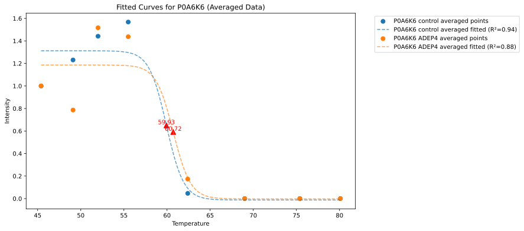
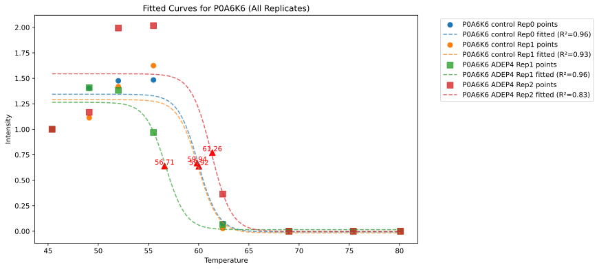
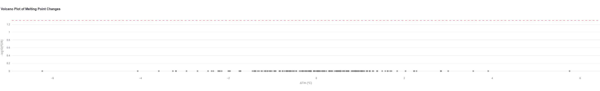
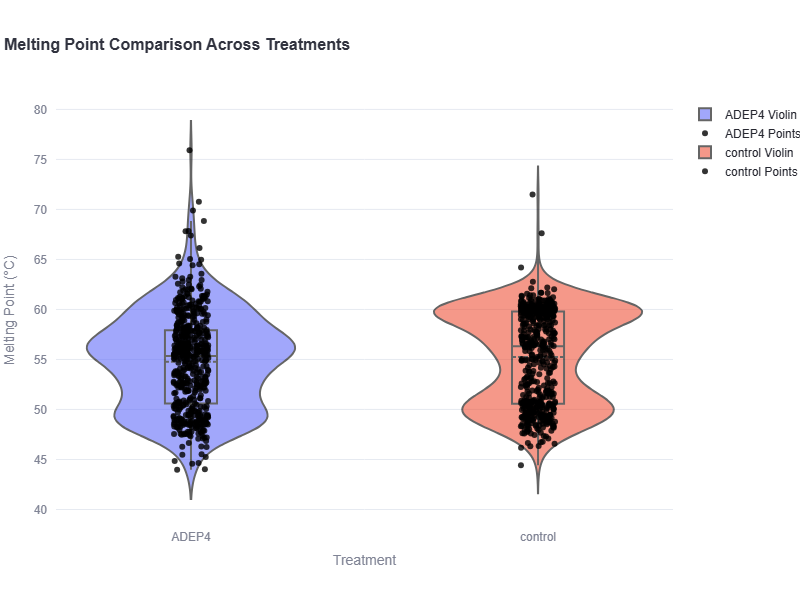
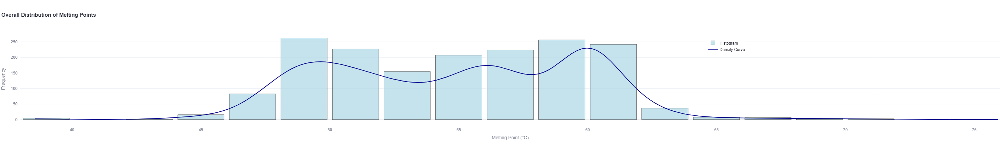
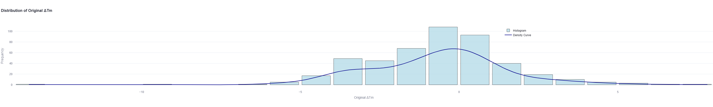

# **TPP Solver**

  

A hosted Streamlit application for analyzing protein thermal stability using Thermal Proteome Profiling (TPP). The app provides sigmoidal curve fitting, statistical analyses, and Gene Ontology (GO) annotation, offering comprehensive insights into protein stability and functionality.

---

## **Key Features**

- **Data Upload**:
  - Supports TSV (fragpipe output) and CSV (metadata) files.
  - Load example data for quick testing and demonstration.
  - In-app data editing with saving options.
  
- **Data Processing**:
  - Imputation of missing values with random values.
  - Filtering options based on user-defined thresholds.

- **Curve Fitting**:
  - Sigmoidal curve fitting with R² filtering.
  - Normalization based on user-selected temperatures.

- **Statistical Analysis**:
  - **Mann-Whitney U Test**:
    - Non-parametric test comparing melting points between treatments for each protein.
    - Suitable for data that is not normally distributed.
    - Calculates effect size and median difference for meaningful biological interpretation.
  - **Benjamini-Hochberg FDR Correction**:
    - Adjusts p-values for multiple testing to control the false discovery rate.
    - Identifies proteins with statistically significant changes in melting points.
  - **Visualizations**:
    - **Volcano Plot**:
      - Displays ΔTm vs. -log10(FDR) for all tested proteins.
    - **Interactive Table**:
      - Highlights significant changes with p-value, FDR, and effect size.

- **Gene Ontology (GO) Annotation**:
  - Integrates GO IDs, biological functions, and protein names.

- **Data Visualization**:
  - Distribution histograms with density curves.
  - Interactive violin plots comparing treatments.
  - GO visualization for significant ΔTm values.

- **Downloadable Results**:
  - Zipped packages containing SVG plots and analysis summaries.

---

## **How to Use**

1. **Access the App**:
   Visit the hosted app at [TPP Solver](https://tppsolver.gnps2.org/).

2. **Upload Your Data**:
   - Upload TSV and CSV files, or load sample data for testing.
   - Optionally edit the data before analysis.

3. **Set Analysis Parameters**:
   - Define thresholds, normalization settings, and GO annotation preferences.

4. **Run the Analysis**:
   - Click "Start Analysis" to generate results, including sigmoidal curves and summary statistics.

5. **View and Download Results**:
   - Explore visualizations and download summary tables and plots.

---

## **Sample Output**

### **Melting Curve**

  
  

Example of a melting curve, showing normalized protein intensity across temperatures.

---

### **Statistical Analysis**

#### **Interactive Table**
| Protein   | Control Tm        | Treatment Tm      | ΔTm   | P-value   | Effect Size | n_control | n_treatment | FDR  | Significant | Significance |
|-----------|-------------------|-------------------|-------|-----------|-------------|-----------|-------------|------|-------------|--------------|
| Q2M7R5    | 63.25 ± 4.17 °C   | 57.03 ± 0.72 °C   | -6.23 | 0.333     | 0.775       | 2         | 2           | 1.0  | False       | ns           |
| P23882    | 43.97 ± 7.32 °C   | 49.73 ± 3.05 °C   |  5.76 | 0.667     | 0.387       | 2         | 2           | 1.0  | False       | ns           |
| P24200    | 58.74 ± 4.43 °C   | 54.68 ± 1.86 °C   | -4.06 | 0.667     | 0.387       | 2         | 2           | 1.0  | False       | ns           |
| P03841    | 56.08 ± 1.48 °C   | 59.99 ± 0.29 °C   |  3.91 | 0.333     | 0.775       | 2         | 2           | 1.0  | False       | ns           |
| P0A8K5    | 64.52 ± 3.82 °C   | 60.94 ± 1.01 °C   | -3.58 | 0.333     | 0.775       | 2         | 2           | 1.0  | False       | ns           |

#### **Volcano Plot**
The volcano plot shows ΔTm (x-axis) versus the -log10(FDR) (y-axis) for each tested protein. Significant proteins are highlighted, allowing quick identification of biologically relevant changes.

  

---

### **Summary Table with Individual Replicates**

| protein   | Protein Name                            | treatment | melting_point |        R² | residuals                         | GO ID                                           | Function                     | Link                                   |
|-----------|-----------------------------------------|-----------|---------------|-----------|------------------------------------|------------------------------------------------|------------------------------|----------------------------------------|
| P0A7X3    | Small ribosomal subunit protein uS9     | control   | 47.96         | 0.999661  | -9.7e-05,0.0015,...               | GO:0000049;GO:0022627;...                    | tRNA binding;...             | [Link](https://www.uniprot.org/uniprotkb/P0A7X3) |
| P0A7X3    | Small ribosomal subunit protein uS9     | control   | 45.57         | 0.999992  | -3.7e-07,0.0001,...               | GO:0000049;GO:0022627;...                    | tRNA binding;...             | [Link](https://www.uniprot.org/uniprotkb/P0A7X3) |
| P0A7X3    | Small ribosomal subunit protein uS9     | ADEP4     | 47.02         | 0.999935  | -8.0e-06,0.0005,...               | GO:0000049;GO:0022627;...                    | tRNA binding;...             | [Link](https://www.uniprot.org/uniprotkb/P0A7X3) |
| P0A7X3    | Small ribosomal subunit protein uS9     | ADEP4     | 47.13         | 0.999918  | -1.1e-05,0.0006,...               | GO:0000049;GO:0022627;...                    | tRNA binding;...             | [Link](https://www.uniprot.org/uniprotkb/P0A7X3) |
| P22524    | Chromosome partition protein MukE       | control   | 48.35         | 0.999380  | -0.0003,0.0025,...                | GO:0007059;GO:0030261;...                    | chromosome segregation;...   | [Link](https://www.uniprot.org/uniprotkb/P22524) |

---

## **Input File Format**

### **Metadata CSV File**

The metadata CSV file should follow this format:

| filename    | Temperature | Treatment | Samples         |
|-------------|-------------|-----------|-----------------|
| C_1_1.mzML  | 45.4        | control   | C_1_1 Intensity |
| C_2_1.mzML  | 45.4        | control   | C_2_1 Intensity |
| C_1_2.mzML  | 49.1        | control   | C_1_2 Intensity |
| C_2_2.mzML  | 49.1        | control   | C_2_2 Intensity |
| ...         | ...         | ...       | ...             |
| T_2_8.mzML  | 80.1        | ADEP4     | T_2_8 Intensity |

Explanation of the metadata file columns:
1. **filename**: The experimental output file name (e.g., mzML).
2. **Temperature**: The temperature (°C) at which the sample was treated.
3. **Treatment**: Experimental condition (e.g., control or ADEP4).
4. **Samples**: The unique identifier for each sample (e.g., C_1_1 Intensity).

**Note**: Entries with the same `Temperature` and `Treatment` are considered replicates.

---
## **Additional Graphs**

### **Violin Plot** 

  

### **Tm Distribution**

  

### **ΔTm Distribution**

  

## **Requirements**

- **TSV file**: Intensity data from FragPipe.
- **CSV file**: Metadata (formatted as described above)
