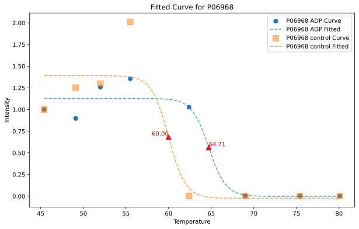

# TPP Analysis App

  

This hosted Streamlit application performs Thermal Proteome Profiling (TPP) analysis on protein data.
## Sample Output

After processing your data, the application generates curves for each protein. Here's an example of what an output curve looks like:

  

This figure shows a typical melting curve generated by the TPP Analysis App. It displays the protein's normalized intensity across different temperatures, allowing you to visualize the thermal stability profile of the protein under various conditions.

### Summary Table

The application generates a summary CSV file containing the analysis results. Here's a snippet of what the summary table looks like:

| protein_id | treatment | melting point | residuals |
|------------|-----------|---------------|-----------|
| P0A955 | ADP | 62.72338057 | -0.20310909,-0.43572374,0.36761320,0.27191688,-0.00084949,0.00070134,-0.00027961,-0.00026950 |
| P0A955 | control | 60.41760935 | -0.22177486,-0.12388297,-0.03996652,0.39166188,-0.02646785,0.00638937,0.00742489,0.00661606 |
| P0ADX7 | ADP | 60.43685722 | -2.98417009,-1.52360630,2.95880721,1.57419488,-0.10878608,0.04481456,0.02078611,0.01795950 |
| P0ADX7 | control | 59.63033021 | -0.59946255,-0.38455060,0.98511892,-0.00014792,-0.00835472,-0.00000083,0.00020939,0.00718827 |
| P67095 | ADP | 62.95687359 | -0.44341943,-1.43903604,1.79195880,0.09079231,-0.00032441,-0.00302128,0.00163866,0.00141141 |

This table shows:
- protein_id: Unique identifier for each protein
- treatment: The experimental condition (ADP or control)
- melting point: The calculated melting point for the protein under the given condition
- residuals: The differences between observed and predicted values from the curve fitting

The full summary.csv file contains this information for all analyzed proteins.

## Description

The TPP Analysis App processes raw data from TSV files and metadata from CSV files to analyze protein thermal stability. It performs curve fitting, generates plots for each protein, and provides downloadable results.

## Features

- Upload and process TSV (raw data) and CSV (metadata) files
- Filter data based on a user-defined maximum number of allowed zero values
- Impute missing data
- Perform curve fitting using a sigmoid function
- Generate and display plots for each protein
- Provide downloadable ZIP file containing SVG plots and a summary CSV

## Usage

1. Access the TPP Analysis App at [insert hosted app URL here]

2. Upload your TSV (raw data) and CSV (metadata) files using the file upload widgets

3. Adjust the "Maximum number of zeros allowed" as needed

4. Click "Continue Analysis" to process the data and generate results

5. Download the zipped SVG files containing the protein curves and summary data

## Input File Format

### Metadata CSV File

The metadata CSV file should follow this format:

| filename    | Temperature | Treatment | Samples         |
|-------------|-------------|-----------|-----------------|
| C_1_1.mzML  | 45.4        | control   | C_1_1 Intensity |
| C_2_1.mzML  | 45.4        | control   | C_2_1 Intensity |
| C_1_2.mzML  | 49.1        | control   | C_1_2 Intensity |
| C_2_2.mzML  | 49.1        | control   | C_2_2 Intensity |
| ...         | ...         | ...       | ...             |
| T_2_8.mzML  | 80.1        | ADP       | T_2_8 Intensity |
| T_3_8.mzML  | 80.1        | ADP       | T_3_8 Intensity |

Note: There are no specific naming requirements for the metadata CSV file itself. You can name it as you prefer, as long as it's a valid CSV file.

Explanation of the metadata file columns:

1. **filename**: This should be the name of the experimental output file, such as mzML
2. **Temperature**: The temperature with which the sample was treated (in °C).
3. **Treatment**: The treatment condition (e.g., 'control' or 'ADP' in the example).
4. **Samples**: The unique identifier for each sample, such as C_1_1 or T_3_2 in the example

**Important: Entries with the same Temperature and Treatment are treated as replicates.** 

For example, in the table above, C_1_1 and C_2_1 are replicates because they have the same Temperature (45.4) and Treatment (control).

Each row represents a unique combination of temperature, treatment, and sample. The 'Intensity' in the Samples column refers to the measurement type in your raw data file.

Ensure your metadata CSV file follows this format for the application to process it correctly.

## Requirements

- TSV file containing intensity data acquired from FragPipe
- CSV file containing metadata (formatted as described above)

## Contact

Lukas Dolidze - [ldoli002@ucr.edu](mailto:ldoli002@ucr.edu?subject=TPP%20Curve%20Fitting%20App)

App URL: [insert hosted app URL here]